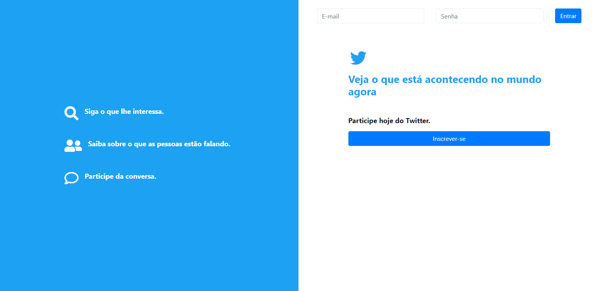
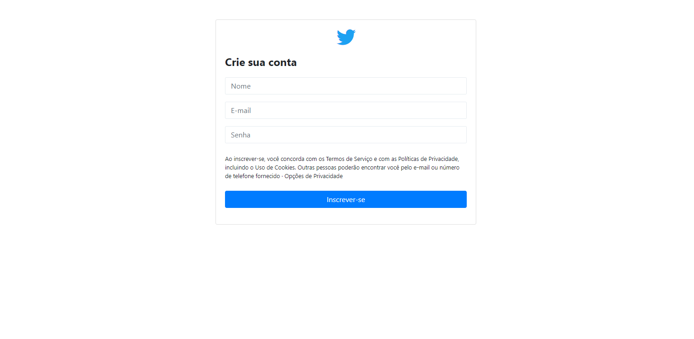
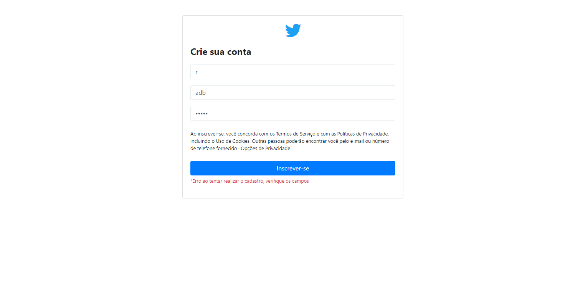
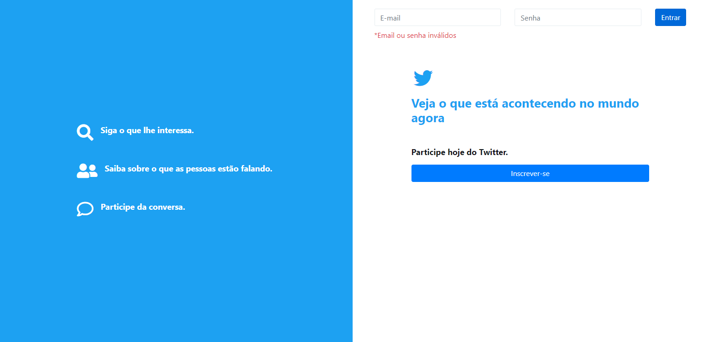
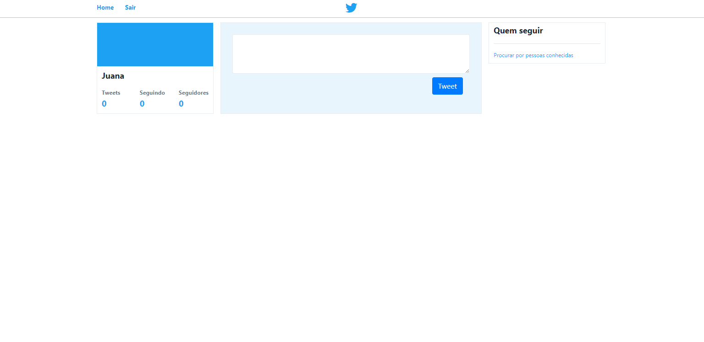
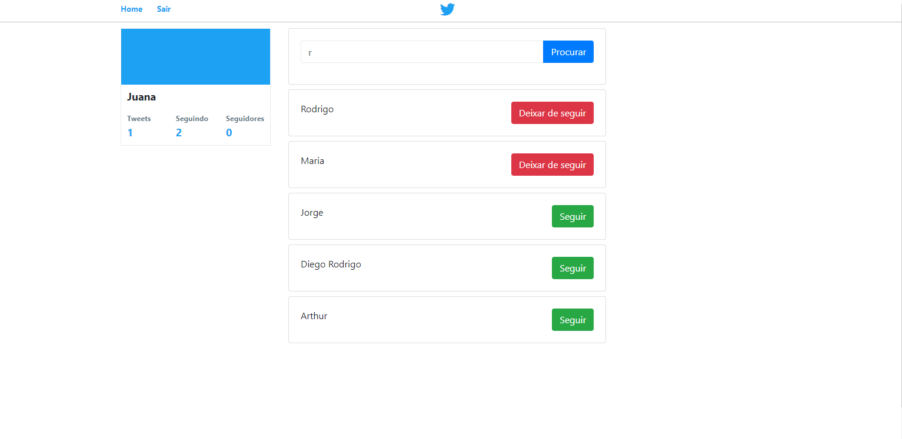
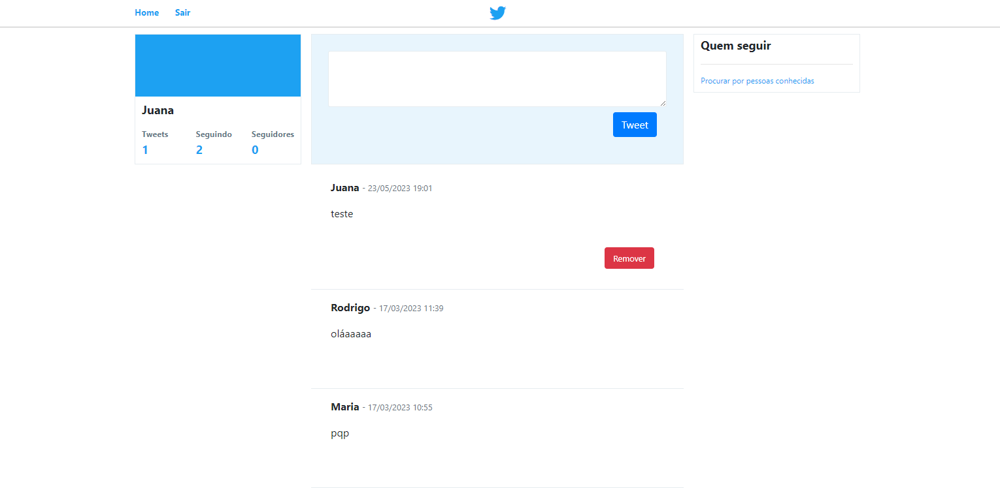
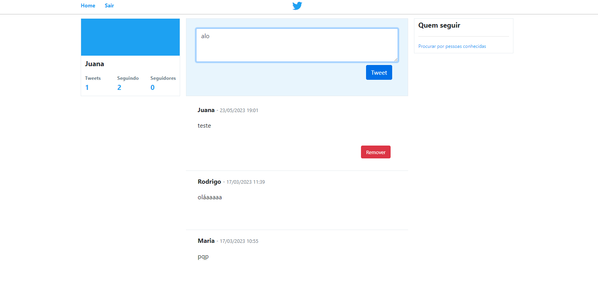
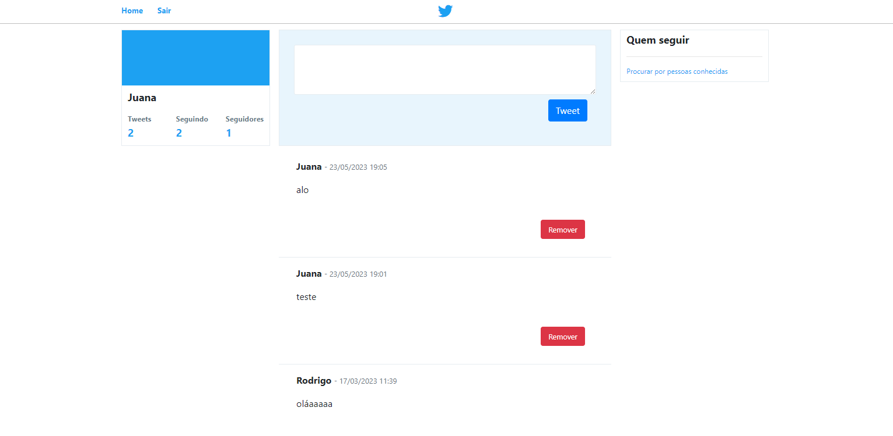
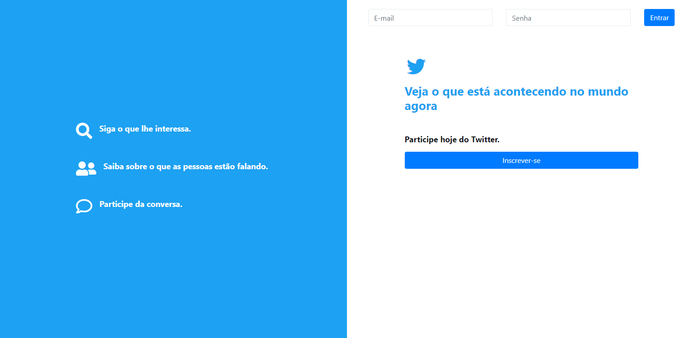

<h1 align="center"> App Twitter</h1>

Aplicação que simula algumas funções do twitter

<h3 align="center">Página inicial</h3>

Preview da página inicial (Zoom: 100%)

<h3 align="center">Cadastro</h3>

Preview da página de cadastro (Zoom: 100%)

<h3 align="center">Erro ao cadastrar</h3>

Preview do erro ao tentar se cadastrar (Zoom: 100%)

<h3 align="center">Cadastro realizado</h3>

Preview da página ao realizar o cadastro com sucesso (Zoom: 100%)

<h3 align="center">Erro no login</h3>

Preview da página inicial ao nao conseguir realizar login (Zoom: 100%)

<h3 align="center">Sucesso no login</h3>

Preview da página ao realizar login com sucesso(timeline) (Zoom: 100%)

<h3 align="center">Timeline Ex 1</h3>

Preview da timeline de um usuario que logou e fez um tweet (Zoom: 100%)

<h3 align="center">Pesquisa de usuários</h3>

Preview da página de pesquisa de outros usuários (Zoom: 100%)

<h3 align="center">Timeline Ex 2</h3>

Preview da timeline após seguir dois usuários (Zoom: 100%)

<h3 align="center">Tweetando</h3>

Preview da página inicial simulando um novo tweet sendo feito pelo usuário (Zoom: 100%)

<h3 align="center">Timeline Ex 3</h3>

Preview da timeline após fazer o segundo tweet (Zoom: 100%)

<h3 align="center">Logoff</h3>

Preview da página após clicar no botao "sair" (Zoom: 100%)

## Ferramentas

- HTML
- CSS
- Bootstrap
- PHP
- PDO
- PHTML
- Mysql
- MVC
- Git
- Github
